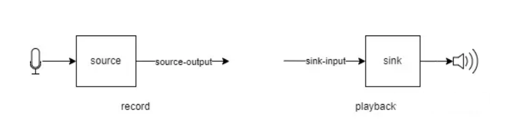
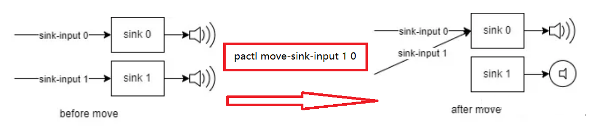
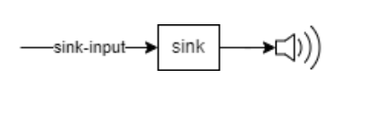
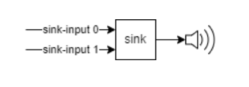
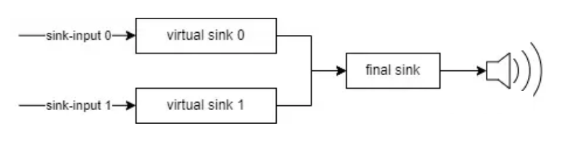

# Linux 音频子系统

## [PulseAudio Terminology](https://zhuanlan.zhihu.com/p/589527476)

sink,source,sink-input,source-output

一个形象的比喻

- 如果把音频流比作河流的话,那sink就相当于大海,是流的目的和归宿,流入大海的流就叫sink-input
- source就相当于河流的源头,是流的开始和起源,从源头流出来的流就叫source-output

在PulseAudio中

- sink就是用来播放的设备,sink-input就是播放的流
	播放的过程就是创建一个sink-input,并把它连接到相应的sink上
- source就是录音的设备,source-output就是录音的流
	录音的过程就是创建一个source-output,并把它连接到相应的source上

### pulseaudio中的modules

PulseAudio启动时会加载各种modules
daemon与modules相互配合一起成为声音系统作为底层设备的封装为上层提供服务
modules在/usr/lib64/pulseaudio/modules/目录下

比如module-alsa-sink / module-alsa-source

	ALSA设备在PulseAudio层面的逻辑抽象,alsa-sink用来播放声音,alsa-source用来录制声音

module-null-sink / module-null-source

	类似于/dev/null
	把sink-input连接到null-sink上就好像往黑洞里播放声音,什么都听不见
	把source-output连接到null-source上的话,只会录回来一堆静音数据

module-sine

	该module会创建一个sink-input,往指定的sink播放正弦波

module-loopback

	把声音录到以后不多加处理,想直接播出去的话,就可以使用module-loopback了

比如下图所示,可以通过pactl move-sink-input 1 0来将左边状态改成右边,两路声音都往一个扬声器输出

### 声音音量控制 mute / volume

调整音量就是对PCM格式的音频数据做乘法

如下图所示,一个sink上只连接了一个sink-input
那调整sink的音量和调整sink-input的音量并没有本质区别

如下图所示
一个sink上面连接了两个sink-input
此时调整sink的音量,会使两种声音的音量一同变化
如果不想两种声音的音量一起变化,可以固定sink的音量为0 dB,分别调整sink-input 0和sink-input 1的音量

如下图所示(使用virtual sink)
sink-input 0连接到virtual sink 0上
sink-input 1连接到virtual sink 1上
再把两个virtual sink的输出作为最终sink的输入
此时可以固定sink-input 0,sink-input 1,final sink的音量
分别调整vritual sink 0和virtual sink 1的音量,也可以实现分别调整两个声音音量的目的

## 查看声卡被应用占用情况

	fuser -v /dev/snd/*

## alsa和pulseaudio关系

1. alsa是linux内核中的音频子系统,可以通过该子系统直接操作控制声卡
2. pulseaudio位于应用层,能够将多路音频混合后再输出到声卡,满足多个应用同时使用声卡

## 常用软件对pulseaudio和alsa支持情况

如果是普通用户启动的pulseaudio,root用户是操作使用不了的
一般情况下linux系统中都会运行一个pulseaudio程序

如果是普通用户$ pulseaudio --start
如果是普通用户# pulseaudio --system

### MPV

mpv 通过--ao= 参数来选择对应的声音输出驱动

查看可配置项目

	mpv --ao=help
	Available audio outputs:
	  pulse            PulseAudio audio output
	  alsa             ALSA audio output
	  null             Null audio output
	  pcm              RAW PCM/WAVE file writer audio output

使用alsa

	mpv --ao=alsa demo.mp4

将视频文件中的音频dump到文件中(输出pcm数据文件)

	mpv --ao=pcm demo.mkv

### alsa-utils

可以使用pacmd(pulseaudio-utils)查看接入的是Rear/Front mic

	pacmd list-cards | grep mic | grep "available: yes"

一般HeadPhone(头戴式耳机)上是Front Microphone和Headphones

使用arecord来录制声音(alsamixer中enable Rear/Front Mic)

	arecord -f cd -t wav a.wav

再用aplay播放(alsamixer中enable Speaker/Headphone)

	aplay a.wav

使用aplay -L查看声卡设备

	default:CARD=PCH
	sysdefault:CARD=PCH
	plughw:CARD=HDA,DEV=0
	hw:CARD=HDA,DEV=0
	...
	pulse

使用aplay -D 来指定使用声卡设备格式如下

	aplay -D plughw:CARD=HDA,DEV=0 /usr/share/sounds/alsa/Noise.wav

或者用aplay -l查看声卡设备号(HDA对应的声卡是1)

	aplay -D plughw:1,0 /usr/share/sounds/alsa/Noise.wav

使用系统默认声卡(通过内核alsa框架,不需要pulseaudio参与,不能多个应用同时播放)

	aplay -D sysdefault:CARD=PCH /usr/share/sounds/alsa/Noise.wav

让aplay使用pulseaudio来输出声音(可以支持多个应用同时播放)

	aplay -D pulse /usr/share/sounds/alsa/Noise.wav

dump硬件参数配置

	aplay --dump-hw-params -D sysdefault /usr/share/sounds/alsa/Noise.wav
	aplay --dump-hw-params -D hdmi /usr/share/sounds/alsa/Noise.wav
	aplay --dump-hw-params -D pulse /usr/share/sounds/alsa/Noise.wav
	aplay --dump-hw-params -D hw /usr/share/sounds/alsa/Noise.wav

此时如果没有启动pulseaudio,会自动拉起pulseaudio服务

	/usr/bin/pulseaudio --start --log-target=syslog

测试左右声道(会使用到pulseaudio)

	speaker-test -t wav -c 2

调整card 0的声音参数

	alsamixer -c 0 --view=ALL

## [QEMU中使用音频](../virtopt/audio.md)

## 音频文件信息

查看音频文件中的信息

	ffprobe /usr/share/sounds/alsa/Noise.wav
	Stream #0:0: Audio: pcm_s16le ([1][0][0][0] / 0x0001), 48000 Hz, 1 channels, s16, 768 kb/s

查看mp3文件信息(aplay -f S16 -r44100 input.mp3无法正常播放)

	ffprobe input.mp3
	Stream #0:0: Audio: mp3, 44100 Hz, stereo, fltp, 128 kb/s
	Stream #0:1: Video: mjpeg (Progressive), yuvj444p(pc, bt470bg/unknown/unknown), 600x600, 90k tbr, 90k tbn, 90k tbc (attached pic)

转成wav文件,查看wav文件信息,此时文件可用aplay播放

	ffmpeg -i input.mp3 output.wav

	ffprobe output.wav
	Stream #0:0: Audio: pcm_s16le ([1][0][0][0] / 0x0001), 44100 Hz, 2 channels, s16, 1411 kb/s

	aplay -f S16 -r44100
