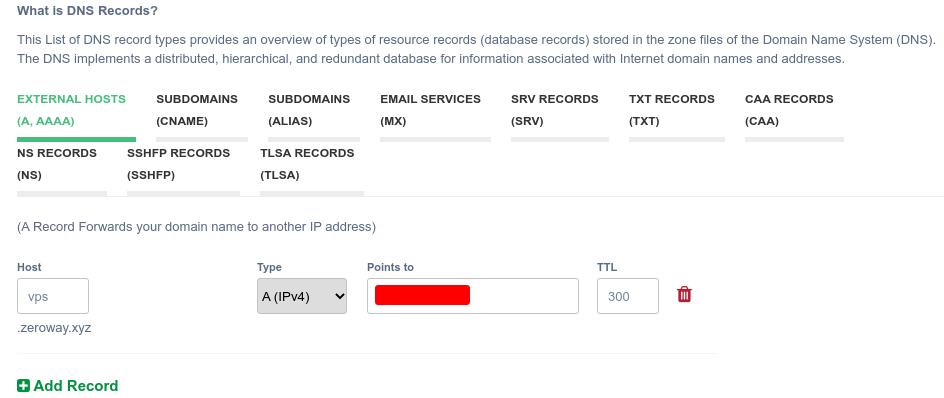

# VPS服务器配置

## xray配置

### 安装必要软件

vps server以debian10为例,先安装软件

	apt update -y && apt install -y curl socat

安装acme脚本

	curl https://get.acme.sh | sh -s email=your-mail-address@mail.com

### 域名解析到服务器

现有一个二级域名为zeroway.xyz,可以将vps.zeroway.xyz这个三级域名解析到vps服务器ip地址

确认是否成功解析

	ping vps.zeroway.xyz

### 配置证书

配置防火墙打开80端口用于证书申请

	iptables -I INPUT -p tcp --dport 80 -j ACCEPT

申请证书(可以修改证书申请机构 ~/.acme.sh/acme.sh  --set-default-ca --server letsencrypt)

	MDN="vps.zeroway.xyz"
	~/.acme.sh/acme.sh --issue -d $MDN --standalone
	~/.acme.sh/acme.sh --installcert -d $MDN --key-file /root/private.key --fullchain-file /root/cert.crt

### 安装xray(x-ui面板)

安装Xray

	bash <(curl -Ls https://raw.githubusercontent.com/vaxilu/x-ui/master/install.sh)

配置防火墙端口(这里的8888是在安装是指定的),用于网页登录x-ui控制台

	iptables -I INPUT -p tcp --dport 8888 -j ACCEPT

### 创建各种节点

- vless 对应 xray
- vmess 对应 v2ray
- trojan 等等

在面板上配置节点后,需要配置对应的端口才可以访问

	iptables -I INPUT -p tcp --dport 443 -j ACCEPT

客户端连接时v2ray-ng的android客户端关闭证书验证

## trojan配置

- 服务器ip 11.22.33.44
- 密码this_passwd
- 端口号: 1080

安装 net-proxy/trojan

修改配置文件

	sed -e 's/server_ip_stub/11.22.33.44/' -e 's/password_stub/this_passwd/' client.json

服务端启动trojan(客户端同理)

	trojan -c server.json

### http代理配置

torjan默认只有socks5代理,需要通过(net-proxy/privoxy)来转发支持http代理

修改配置文件/etc/privoxy/config如下(只需要下面内容)

	listen-address  0.0.0.0:8118 		#监听任意ip的8118端口
	forward-socks5t / 127.0.0.1:1080 .  #设置转发到本地的socks5代理客户端端口
	forward 10.*.*.*/ . 				#内网地址不走代理
	forward .abc.com/ . 				#指定域名不走代理

添加到开机启动

	rc-update add privoxy default

启动privoxy后查看privoxy运行情况

	lsof -i :8118

## 单独配置浏览器使用代理

使用socks代理

	set content.proxy socks://localhost:1080

使用http代理

	set content.proxy http://localhost:8118

## 单独配置git使用代理(http代理相应替换即可)

Create a file gitproxy.sh with content:

	#!/bin/sh
	nc -X 5 -x 127.0.0.1:1080 "$@"

Edit ~/.gitconfig

	[core]
		gitproxy=/path/to/gitproxy.sh

	[http]
		proxy=socks5://127.0.0.1:1080

	[https]
		proxy=socks5://127.0.0.1:1080

Edit /etc/ssh/ssh_config to change global setting (or ~/.ssh/config for special host)

	ProxyCommand nc -X 5 -x 127.0.0.1:1080 %h %p

## 全局配置使用代理

在shell脚本中添加如下函数source后可手动开关

	function openProxy() {
		export no_proxy="localhost,127.0.0.1,localaddress,.localdomain.com"
		export http_proxy="http://127.0.0.1:8118"
		export https_proxy=$http_proxy
		echo -e "OpenProxy"
	}

	function closeProxy() {
		unset http_proxy
		unset https_proxy
		echo -e "CloseProxy"
	}

带开全局代理后在终端输入下面命令有输出则表示代理开启成功

	curl -i google.com
